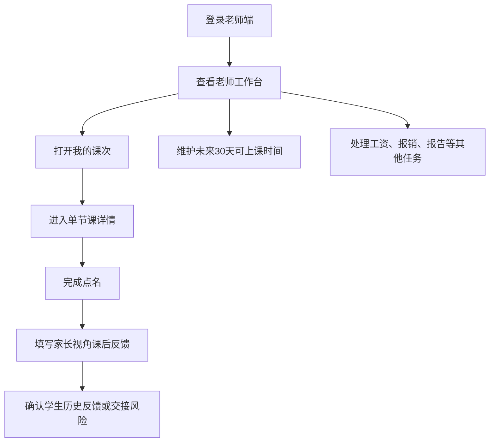
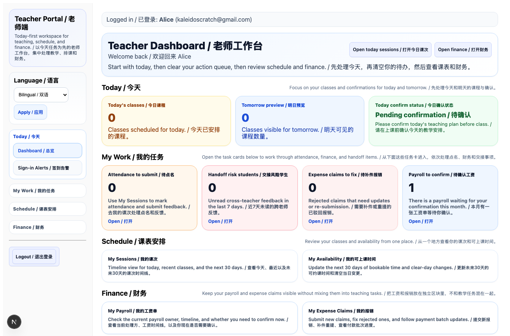
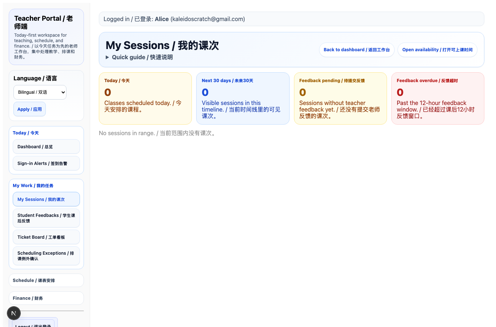
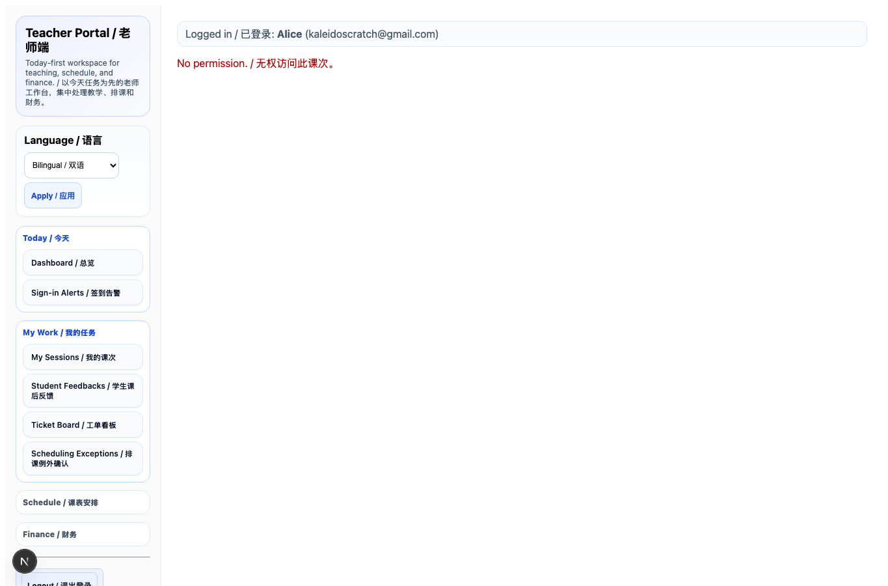
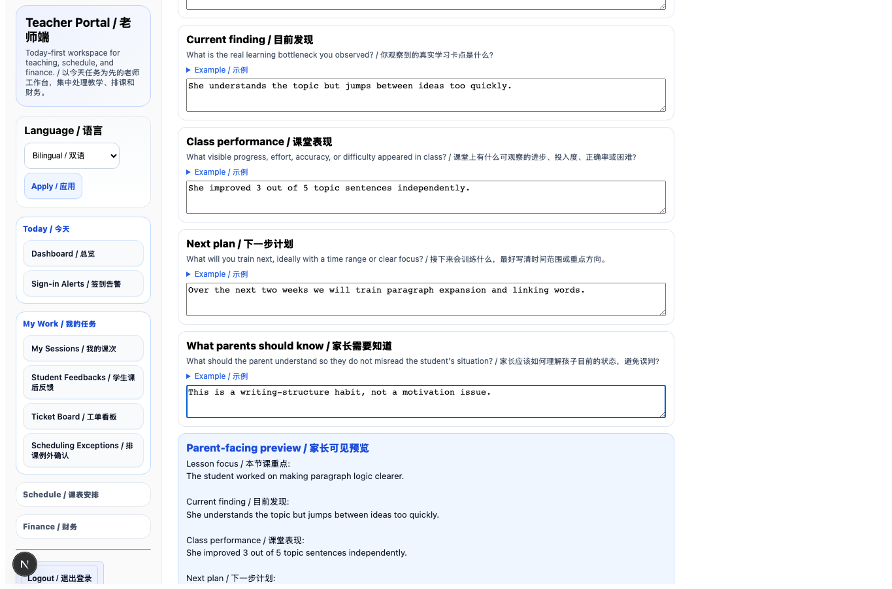
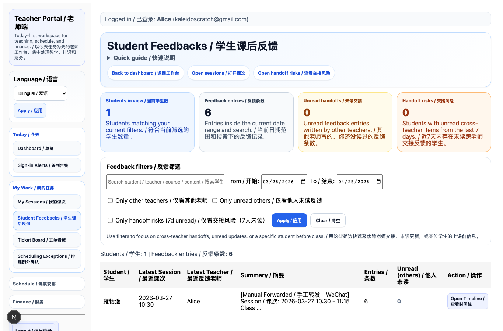
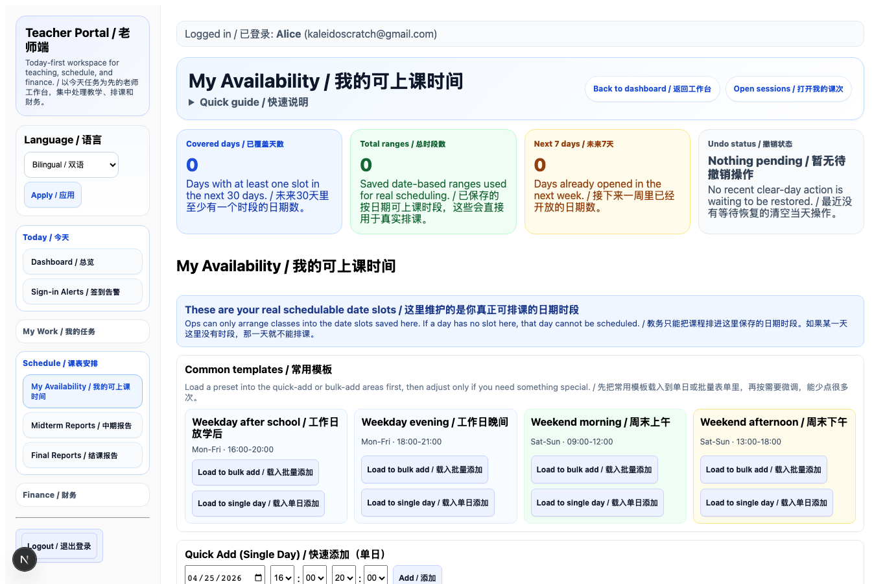

# SOP 老师端操作流程图文版

适用对象：所有使用老师端的授课老师  
入口地址：`https://sgtmanage.com/teacher`  
更新日期：2026-04-25

## 一、老师每天的标准操作顺序



老师端的日常优先级是：

1. 先看今天有没有课和待办。
2. 每节课后先完成点名。
3. 再填写家长视角课后反馈。
4. 有交接学生时，课前先看学生历史反馈。
5. 每周至少维护一次未来 30 天可上课时间。

## 二、登录后先看老师工作台



进入老师端后，先看 `Teacher Dashboard / 老师工作台`。

老师需要重点看四个区域：

- `Attendance to submit / 待点名`：今天需要处理点名和反馈的课次。
- `Handoff risk students / 交接风险学生`：近期其他老师写过、但你还没读的学生反馈。
- `Expense claims to fix / 待补件报销`：被财务退回、需要补充的报销。
- `Payroll to confirm / 待确认工资`：本月是否有工资单等待确认。

建议老师每天上课前先点 `Open today sessions / 打开今日课次`。

## 三、打开“我的课次”



在左侧菜单或工作台点击 `My Sessions / 我的课次`。

这个页面会显示今天、最近和未来 30 天的课次，并给出每节课的两个状态：

- `Attendance / 点名`：显示这节课学生是否已经点名。
- `Feedback / 反馈`：显示课后反馈是否已提交、是否超时。

操作规则：

1. 找到对应日期和时间的课。
2. 点击课次右侧的 `Open / 打开`。
3. 进入单节课详情后，不要在列表页处理具体反馈。

## 四、进入单节课详情



单节课详情页是老师处理一节课的主页面。

进入后先看三个状态卡：

- `Attendance status / 点名状态`
- `Feedback status / 反馈状态`
- `Next action / 下一步`

系统会提醒当前最应该做什么。正常顺序是：

1. 先完成点名。
2. 再提交课后反馈。
3. 如果点名和反馈都完成，就可以返回我的课次。

## 五、完成点名

在 `Attendance / 点名` 区域，老师需要给每位学生选择状态。

常见状态说明：

- `PRESENT`：正常到课。
- `LATE`：迟到。
- `ABSENT`：缺课。
- `EXCUSED`：请假。
- `UNMARKED`：未点名，不要保留这个状态。

点名要求：

1. 每位学生都必须有明确状态。
2. 如有迟到、缺课、请假，建议在备注写明原因。
3. 点名保存后，再继续写课后反馈。

## 六、填写家长视角课后反馈



课后反馈现在不是写“今天讲了什么知识点”，而是写给家长看的学生进展说明。

页面会显示五个独立输入区。每个区块都有中英文标题、提示和可展开示例；老师只需要在空白输入框里写答案，不需要删除提示。

```text
Lesson focus / 本节课重点
Prompt: What learning problem did the student mainly work on today?
[Write your answer here / 在这里写答案]

Current finding / 目前发现
Prompt: What is the real learning bottleneck you observed?
[Write your answer here / 在这里写答案]

Class performance / 课堂表现
Prompt: What visible progress, effort, accuracy, or difficulty appeared in class?
[Write your answer here / 在这里写答案]

Next plan / 下一步计划
Prompt: What will you train next, ideally with a time range or clear focus?
[Write your answer here / 在这里写答案]

What parents should know / 家长需要知道
Prompt: What should the parent understand so they do not misread the student's situation?
[Write your answer here / 在这里写答案]
```

系统会在下方自动生成 `Parent-facing preview / 家长可见预览`。老师提交前可以先看预览，确认家长收到的内容是否自然。

完整示例：

```text
Lesson focus / 本节课重点:
The main focus today was helping the student make English writing clearer at the sentence-structure level. / 孩子今天主要解决英文写作中句子结构不清晰的问题。

Current finding / 目前发现:
He can understand the passage, but when writing, he tends to translate directly from Chinese logic, so the sentences sound unnatural. / 他能理解文章意思，但表达时容易用中文逻辑直译，导致句子不自然。

Class performance / 课堂表现:
Today he completed about 60% of the sentence corrections independently and was more proactive than last week. / 今天可以独立完成 60% 的句子修改，比上周更主动。

Next plan / 下一步计划:
Over the next two weeks, we will focus on idea development and linking words in academic writing. / 接下来 2 周重点训练学术写作里的观点展开和连接词使用。

What parents should know / 家长需要知道:
This is not a lack of effort. The main issue is that his English expression habits have not fully shifted yet, so he needs consistent practice. / 目前不是孩子不努力，而是英文表达习惯还没切换过来，需要连续训练。
```

不要这样写：

```text
今天学习了分词从句，完成了两页练习，布置了 worksheet。
```

要改成：

```text
孩子今天主要训练如何把多个意思自然连接成完整句子。目前他能理解句子意思，但写作时容易直接按中文顺序翻译，所以复杂句会显得不自然。接下来会继续训练连接词和句子展开。
```

## 七、填写作业和旧作业完成情况

课后反馈下方仍然需要填写：

- `Homework / 作业`
- `Previous homework done / 之前作业完成情况`

作业要写清楚：

- 要完成哪一份材料。
- 要完成到哪里。
- 是否需要订正。
- 下节课是否会检查。

例子：

```text
完成 Grammar Synthesis Chapter 3 剩余练习；圈出不确定的连接词，下节课先检查。
```

## 八、查看学生历史反馈



点击 `Student Feedbacks / 学生课后反馈` 可以查看学生近期反馈和其他老师的交接信息。

使用场景：

- 接手一个新学生前，先看历史反馈。
- 同一个学生由多个老师上课时，先看其他老师最近写了什么。
- 看到 `Handoff risk students / 交接风险学生` 时，需要进入这里读完并标记。

老师应重点看：

- 最近几节课孩子的主要问题是否重复出现。
- 其他老师提到的下一步计划。
- 是否有家长需要知道的特殊情况。

## 九、维护可上课时间



点击 `My Availability / 我的可上课时间`。

这里维护未来 30 天真正可以排课的时间。教务排课时会优先读取这里保存的日期时段。

操作要求：

1. 每周至少更新一次未来 30 天可上课时间。
2. 如果某天不能上课，要及时清空当天时段。
3. 如果刚刚误清空，可以使用撤销功能恢复最近一次清空操作。
4. 不确定的时间不要先开放，避免教务排课后再改。

## 十、老师端常见问题

### 1. 为什么反馈不能提交？

通常是因为五个家长视角部分没有写完整。检查是否每个标题下面都有具体内容：

- 本节课重点
- 目前发现
- 课堂表现
- 下一步计划
- 家长需要知道

### 2. 只写英文可以吗？

可以，但要确保家长能看懂。如果家长主要看中文，建议中文为主，必要时保留英文术语。

### 3. 反馈要写多长？

每个部分 1-2 句话即可。重点是具体，不是越长越好。

### 4. 课后多久内要提交反馈？

系统规则是课后 12 小时内提交，超过后会标记为迟交。

### 5. 点名没做能不能先写反馈？

系统允许继续写，但标准流程是先点名，再写反馈。这样教务、工资和课包记录更清楚。

## 十一、老师课后反馈质量标准

合格反馈必须让家长读完后知道：

1. 我的孩子这节课到底解决了什么问题。
2. 老师发现了孩子什么真实卡点。
3. 孩子今天有没有可观察的变化。
4. 后面几节课会怎么继续训练。
5. 家长应该如何理解孩子目前的状态。

一句话标准：**不要让家长只看到“老师今天讲了什么”，要让家长看到“老师真的懂我孩子”。**
