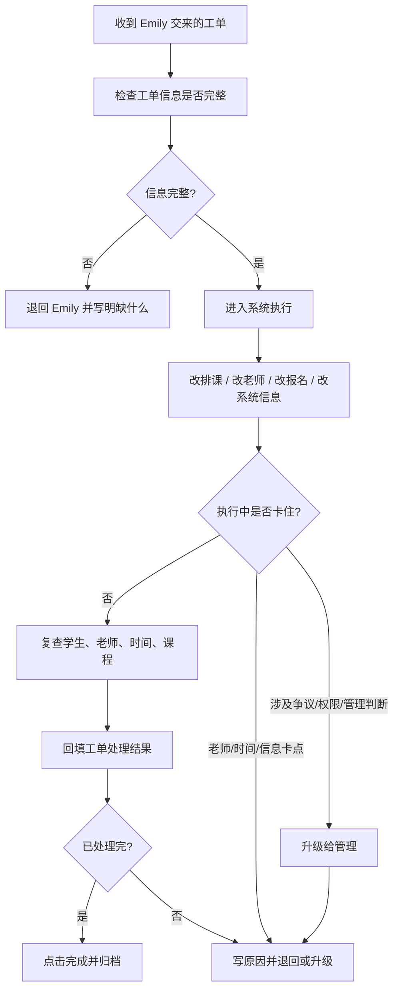

# Eva 岗位流程图 v1

角色定位：
1. 看工单
2. 改系统
3. 回填结果
4. 完成归档
5. 遇到问题退回或升级

```mermaid
flowchart TD
    A["收到 Emily 交来的工单"] --> B["检查工单信息是否完整"]
    B --> C{"信息完整?"}
    C -- "否" --> D["退回 Emily 并写明缺什么"]
    C -- "是" --> E["进入系统执行"]
    E --> F["改排课 / 改老师 / 改报名 / 改系统信息"]
    F --> G{"执行中是否卡住?"}
    G -- "否" --> H["复查学生、老师、时间、课程"]
    H --> I["回填工单处理结果"]
    I --> J{"已处理完?"}
    J -- "是" --> K["点击完成并归档"]
    J -- "否" --> L["写原因并退回或升级"]
    G -- "老师/时间/信息卡点" --> L
    G -- "涉及争议/权限/管理判断" --> M["升级给管理"]
    M --> L
```

## Eva 每天必须做

1. 没工单不改系统。
2. 信息不完整不硬改。
3. 改完必须复查。
4. 改完必须回填工单。
5. 能完成就归档，不能完成就写原因。
