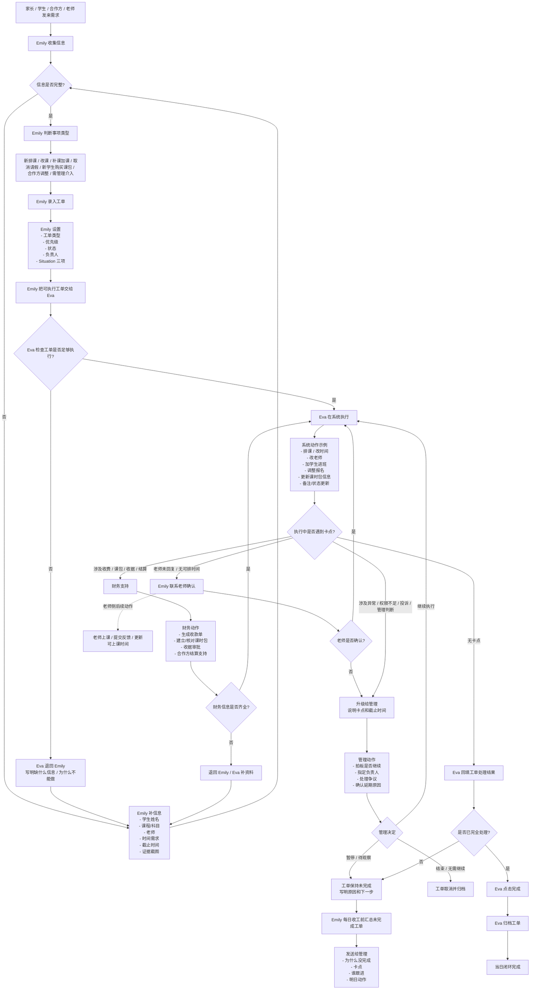

# 两名教务跨岗位工作流程图 v1

适用岗位：
1. Emily（信息收集、沟通协调、工单录入、推进）
2. Eva（系统更新、结果回填、完成归档）
3. 老师（提供可上课时间、确认安排、执行上课、补充反馈）
4. 管理（处理升级事项、拍板异常、监督未闭环事项）
5. 财务（新生收款单、课时包、报销、结算相关支持）

## 一、岗位定位

1. Emily：负责把事情收进来、讲清楚、推进出去。
2. Eva：负责把工单里的要求准确落到系统里。
3. 老师：负责提供可安排时间、确认是否可上课、完成教学相关动作。
4. 管理：负责处理超权限、异常、卡点、争议和未闭环事项。
5. 财务：负责新生收款、课时包/收据/结算/报销等财务链路支持。

## 二、完整流程图

## 三、分岗位一步一步

### 1. Emily

1. 收到消息。
2. 判断是不是要建工单。
3. 所有要处理的事情都建工单。
4. 补齐信息和截图。
5. 写清楚 Situation 三项。
6. 把需要系统执行的交给 Eva。
7. 如果老师/家长/合作方未回复，继续催。
8. 如果卡住，升级给管理。
9. 收工前汇总未完成工单。

### 2. Eva

1. 打开工单中心。
2. 按优先级处理工单。
3. 看工单信息是否完整。
4. 信息不完整就退回 Emily。
5. 信息完整才改系统。
6. 改完后复查学生、老师、时间、课程是否正确。
7. 回填工单结果。
8. 完成就点完成并归档。
9. 不能完成就写明原因并退回/升级。

### 3. 老师

1. 提供可上课时间。
2. 确认能否接课/调课。
3. 如无法接课，尽快回复。
4. 上课后完成点名和反馈。
5. 如自己时间有变化，及时更新 availability。

### 4. 管理

1. 处理升级工单。
2. 处理争议、投诉、长期未回复、权限外事项。
3. 决定是否继续、暂停、取消。
4. 每天收工前看未闭环工单汇总。

### 5. 财务

1. 处理新学生收款单。
2. 建立或核对课时包。
3. 处理收据审批。
4. 处理合作方结算。
5. 对涉及收费的工单提供财务确认。

## 四、管理每日检查点

1. 是否有漏录工单。
2. 是否有工单未回填结果。
3. 是否有已完成但未归档工单。
4. 是否有卡住但未升级的工单。
5. 是否有涉及老师/财务但未被跟进的事项。

## 五、执行原则

1. 先有工单，再有操作。
2. 信息不完整，不硬做。
3. 改完系统，必须回填工单。
4. 当天工单当天清。
5. 清不掉的，当天必须升级说明原因。
6. 涉及收费、课时包、收据、结算，必须让财务链路参与。
7. 涉及争议、投诉、老师失联、合作方异常，必须让管理介入。

