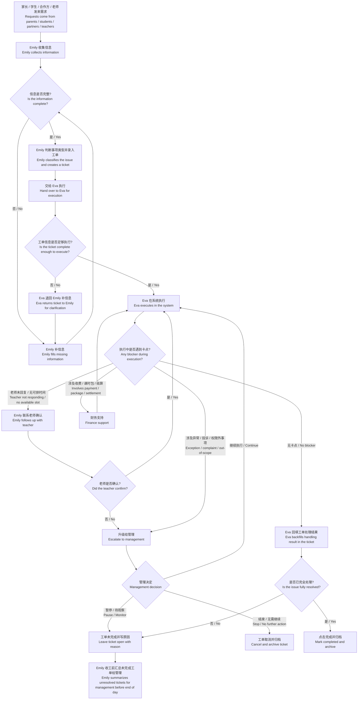

# 两名教务跨岗位工作流程图（中英文对照） v1

适用岗位 / Applicable Roles:
1. Emily（信息收集、沟通协调、工单录入、推进）/ information collection, coordination, ticket intake, follow-up
2. Eva（系统更新、结果回填、完成归档）/ system updates, result backfill, completion and archive
3. 老师 / Teachers
4. 管理 / Management
5. 财务 / Finance

## 一、岗位定位 / Role Positioning

1. Emily：负责把事情收进来、讲清楚、推进出去。  
   Emily: responsible for collecting issues, clarifying them, and pushing them forward.
2. Eva：负责把工单里的要求准确落到系统里。  
   Eva: responsible for executing ticket requests accurately in the system.
3. 老师：负责确认可上课时间、确认是否可接课、完成教学相关动作。  
   Teachers: responsible for confirming availability, confirming whether they can take sessions, and completing teaching actions.
4. 管理：负责处理升级事项、争议、异常和未闭环事项。  
   Management: responsible for escalations, disputes, exceptions, and unresolved items.
5. 财务：负责收款、课时包、收据、结算、报销等财务支持。  
   Finance: responsible for payment collection, packages, receipts, settlement, reimbursement, and finance support.

## 二、完整流程图 / Full Workflow Diagram

## 三、分岗位一步一步 / Step-by-Step by Role

### Emily
1. 收到消息。/ Receive the message.
2. 判断是否必须建工单。/ Decide whether a ticket must be created.
3. 所有需要处理的事情都录工单。/ Create a ticket for every actionable issue.
4. 补齐学生、老师、课程、时间、截止时间、截图。/ Complete student, teacher, course, time, deadline, and screenshots.
5. 写清楚 Situation 三项。/ Write the three Situation fields clearly.
6. 把需要系统执行的工单交给 Eva。/ Hand tickets requiring system action to Eva.
7. 白天持续催老师、家长、合作方。/ Follow up with teachers, parents, and partners during the day.
8. 卡住就升级。/ Escalate when blocked.
9. 收工前汇总未完成工单。/ Summarize unresolved tickets before end of day.

### Eva
1. 打开工单中心。/ Open Ticket Center.
2. 按优先级处理工单。/ Process tickets by priority.
3. 先检查信息是否完整。/ Check whether the ticket is complete.
4. 信息不完整就退回 Emily。/ Return incomplete tickets to Emily.
5. 信息完整才改系统。/ Only update the system when ticket information is complete.
6. 改完后复查学生、老师、时间、课程。/ Recheck student, teacher, time, and course after updating.
7. 回填工单结果。/ Backfill the ticket result.
8. 完成就归档。/ Archive when completed.
9. 不能完成就写原因并退回或升级。/ If not completable, write the reason and return or escalate.

### 老师 / Teachers
1. 提供可上课时间。/ Provide available teaching time.
2. 确认是否能接课或改课。/ Confirm whether they can take or reschedule sessions.
3. 无法接课要尽快回复。/ Reply quickly if unable to teach.
4. 上课后完成点名和反馈。/ Complete attendance and feedback after class.
5. 时间变化时及时更新 availability。/ Update availability promptly when schedule changes.

### 管理 / Management
1. 处理升级工单。/ Handle escalated tickets.
2. 处理争议、投诉、老师失联、权限外事项。/ Handle disputes, complaints, teacher no-response, and out-of-scope issues.
3. 决定继续、暂停、取消。/ Decide whether to continue, pause, or cancel.
4. 每天下班前看未闭环工单。/ Review unresolved tickets before end of day.

### 财务 / Finance
1. 处理新学生收款单。/ Handle new student payment requests.
2. 建立或核对课时包。/ Create or verify lesson packages.
3. 处理收据审批。/ Process receipt approvals.
4. 处理合作方结算。/ Handle partner settlement.
5. 对涉及费用的工单提供财务确认。/ Provide finance confirmation for tickets involving payments.

## 四、执行原则 / Execution Principles

1. 先有工单，再有操作。/ No action without a ticket.
2. 信息不完整，不硬做。/ Do not force execution with incomplete information.
3. 改完系统，必须回填工单。/ Every system change must be backfilled into the ticket.
4. 当天工单当天清。/ Tickets of the day should be cleared on the same day.
5. 清不掉的，当天必须升级说明原因。/ If unresolved, escalate the same day with a written reason.
6. 涉及收费、课时包、收据、结算，必须让财务参与。/ Finance must be involved for payments, packages, receipts, and settlement.
7. 涉及争议、投诉、老师失联、合作方异常，必须让管理介入。/ Management must be involved for disputes, complaints, teacher no-response, and partner exceptions.
