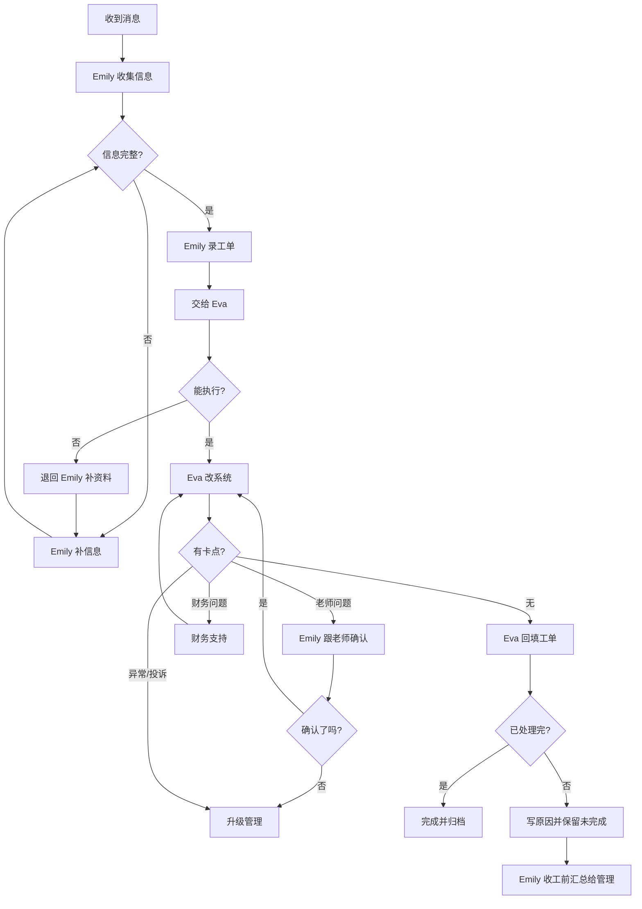

# 两名教务跨岗位工作流程图（墙贴版）v1

## 1. 总流程

## 2. Emily 做什么

1. 收消息
2. 补信息
3. 录工单
4. 推进老师/家长/合作方
5. 工单交给 Eva
6. 卡住就升级管理
7. 收工前汇总未完成工单

## 3. Eva 做什么

1. 看工单
2. 信息完整才改系统
3. 改完复查
4. 回填结果
5. 能完成就归档
6. 不能完成就退回或升级

## 4. 老师做什么

1. 确认可上课时间
2. 确认能否接课/改课
3. 上课后做点名和反馈
4. 时间变化就更新 availability

## 5. 管理做什么

1. 处理升级事项
2. 处理投诉/争议/老师失联
3. 决定继续、暂停、取消
4. 每天下班前看未闭环工单

## 6. 财务做什么

1. 处理收款单
2. 处理课时包
3. 处理收据审批
4. 处理合作方结算
5. 确认涉及费用的工单

## 7. 三条铁规则

1. 先有工单，再有操作
2. 改完系统，必须回填工单
3. 当天工单当天清，清不掉必须当天升级
